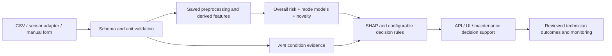

# Final technical report

Generated from executed artifacts at 2026-09-09T13:05:35.051882+00:00. Project: `C:\Users\vanda\OneDrive\Documents\ChatGPT\predictive maintenance agent for manufacturing\predictive_maintenance`.

## Outcome and intended use

The complete generic ML pilot is implemented, trained, evaluated, and exercised through CLI, real HTTP API, and a Streamlit manual form. The system returns probability, binary class, health/urgency, anomaly scores, ranked mode information with score semantics, conditions, contributing features, actions, model version, prediction ID and timestamp. It is a controlled-pilot candidate requiring factory validation and approval, not universally production-approved.



## Data, limitations and quality

Only [AI4I 2020](https://archive.ics.uci.edu/dataset/601/ai4i+2020+predictive+maintenance+dataset) was used; [original UCI ZIP](https://archive.ics.uci.edu/static/public/601/ai4i+2020+predictive+maintenance+dataset.zip). Full provenance and hashes: `data/DATA_SOURCES.md` and `data/raw/manifest.json`.

The dataset has 10,000 rows and 14 columns, including 339 overall failures (3.39%). There are no missing sensor values, invalid categories/labels, duplicate complete rows, or duplicate six-input records. Failure-mode counts are TWF 46, HDF 115, PWF 95, OSF 98, RNF 19. There are 24 multilabel rows and 27 rows where the union of modes disagrees with overall failure. Labels were preserved unchanged. This also explains why CSV counts differ from some narrative source counts.

The data is synthetic milling-process data. Random-walk temperatures and wear cycles can induce row dependence. Random stratification provides an in-dataset benchmark, not machine-separated or temporal generalization. No reliable timestamp, sampling cadence, future prediction horizon, or run-to-failure series is available. No exact downtime, "failure in X hours", RUL, physical root cause, or cross-factory guarantee is claimed. Bootstrap intervals are descriptive and do not account for this dependence.

## Leakage prevention and selection protocol

Seed 42; 6000 training, 2000 validation and 2000 test rows, stratified on overall failure. All six labels plus UDI/Product ID are forbidden predictors. Machine ID, timestamp and production state remain metadata. Automated allowlist tests cover all saved components.

Raw median/mode imputation, derived features and Type one-hot encoding are fitted within each CV training fold. Only logistic regression scales features. Every candidate uses the same allowlisted preprocessing. Class weights/cost sensitivity handle imbalance; validation and test sets are never resampled.

Compared Dummy, logistic regression, random forest, histogram gradient boosting and XGBoost. Five-fold training CV measured PR-AUC, ROC-AUC, failure recall/precision/F1, balanced accuracy and negative Brier score. The two strongest CV candidates received four-setting grids each; sigmoid calibration used training-only cross-validation. Tuned CV scores are non-nested and subject to selection optimism. Calibrated candidate CV fields are intentionally absent because only their underlying tuned estimators have those fold scores.

Selected **random_forest**, a 200-tree random forest (`min_samples_leaf=2`, `max_features=0.8`, `class_weight=balanced_subsample`). Probability calibration: uncalibrated; calibrated candidates compared on validation. Model/threshold selection was frozen before test inference. The selection minimized validation cost 5×FN + FP with recall at least 0.80, then F1/AP/Brier tie-breaks. These are unapproved operational cost assumptions. Selected threshold: **0.279040373384**. No post-test model or threshold change was made. The final estimator remains trained on training rows only; validation was not folded into a post-selection refit.

## Measured overall performance

| Metric | Training CV mean ± SD (threshold 0.5) | Validation (selected threshold) | Untouched test (selected threshold) |
| --- | --- | --- | --- |
| Failure precision | 0.9498 ± 0.0365 | 0.7746 | 0.7763 |
| Failure recall | 0.8326 ± 0.0402 | 0.8088 | 0.8676 |
| Failure F1 | 0.8870 ± 0.0347 | 0.7914 | 0.8194 |
| PR-AUC / average precision | 0.9002 ± 0.0478 | 0.8606 | 0.8856 |
| ROC-AUC | 0.9705 ± 0.0199 | 0.9790 | 0.9677 |
| Balanced accuracy | 0.9155 ± 0.0204 | 0.9003 | 0.9294 |

CV classification metrics above use the estimator's default 0.5 threshold. Validation/test use 0.279040; they therefore answer different operating-point questions. PR-AUC denotes average precision; trapezoidal area is saved separately.

Validation accuracy 0.9855, specificity 0.9917, Brier 0.010243. Test accuracy 0.9870, specificity 0.9912, Brier 0.008606.

Validation confusion matrix: TN=1916, FP=16, FN=13, TP=55.
Untouched test confusion matrix: **TN=1915, FP=17, FN=9, TP=59**.

The 95% stratified row-bootstrap test-recall interval is [0.7794, 0.9412]. Full intervals, classification reports, product-type metrics/supports, candidate grids and frozen predictions are in `reports/metrics/`. Product-type groups have small positive support and do not prove fairness or transfer.

## Failure-mode results

| Mode | Train positives | Test positives | Precision | Recall | F1 | PR-AUC | Component |
| --- | --- | --- | --- | --- | --- | --- | --- |
| TWF | 21 | 10 | 0.0465 | 0.8000 | 0.0879 | 0.0382 | wear_interval_context_indicator_not_validated_probability |
| HDF | 70 | 29 | 0.9355 | 1.0000 | 0.9667 | 0.9853 | independent_random_forest_uncalibrated_probability |
| PWF | 58 | 13 | 1.0000 | 1.0000 | 1.0000 | 1.0000 | independent_random_forest_uncalibrated_probability |
| OSF | 62 | 16 | 1.0000 | 0.6250 | 0.7692 | 0.9875 | independent_random_forest_uncalibrated_probability |
| RNF | 10 | 4 | 0.0000 | 0.0000 | 0.0000 | 0.0020 | constant_training_base_rate_baseline_no_sensor_model |

HDF, PWF and OSF use independent binary random forests and validation-selected thresholds. Mode probabilities are not separately calibrated. TWF had only 21 training positives, below the conservative configured minimum of 50; its numbers evaluate the 200–240 minute context indicator, not dependable ML probabilities. RNF is deliberately unmodeled; numbers reflect a constant training-base-rate baseline. Both expose null `probability` in inference. PWF's perfect test metrics cover only 13 positives and are not a general guarantee. OSF test recall of 62.5% reveals missed mode labels despite high rank discrimination; thresholds were not changed after seeing this result.

Full per-mode confusion matrices and validation/test results are saved. Conditions are AI4I-specific evidence, independent from ML. Deterministic HDF/PWF/OSF conditions can still recommend review when a mode model misses an event. The rare TWF interval and RNF randomness never claim physical certainty.

## Anomaly detection and explanations

Isolation Forest trained on 5797 normal training rows, with 250 trees and contamination 0.02. It uses the six inputs, the three derived features and Type encoding. Displayed anomaly score is the empirical percentile of negative `score_samples` relative to normal training scores; it is not failure probability. Test anomaly rate: 2.20%; normal false-alert rate: 1.71%. It complements classification by detecting unusual conditions without confirming failure.

Most influential raw inputs by validation permutation AP decrease: torque, air_temperature, rotational_speed, process_temperature, tool_wear, product_type. The importance measures associations and can be exaggerated by off-manifold changes among correlated temperature, speed/power, and load/wear variables. All feature names are preserved.

Runtime Tree SHAP explains the deployed random-forest probability and is checked for additive reconstruction. Every transformed contribution is returned so the sum is complete. Saved Kernel SHAP examples explain deployed probability using all coalitions of the six original inputs and 12 training background rows; maximum additivity error is zero in the executed examples. Global permutation importance and a documented non-additive local reference-replacement fallback remain available if SHAP fails. No explanation asserts causality.

## Manual prediction and integration

Healthy example: Type L, 298.1 K air, 308.6 K process, 1450 rpm, 45 Nm, 120 min → model probability **0.000000**, `no_failure`, `Healthy`. This numerical zero from the fitted forest is not evidence of zero real-world risk.

High-risk example: Type L, 302 K air, 310 K process, 1300 rpm, 65 Nm, 220 min → probability **0.953108**, `failure`, `Critical`. Full responses: `examples/sample_output.json` and `examples/high_risk_output.json`.

Run from the project folder using its Python 3.12 environment:

```powershell
python -m src.predict --type L --air-temperature 298.1 --process-temperature 308.6 --rotational-speed 1450 --torque 45 --tool-wear 120
python -m src.predict --csv examples/batch_input.csv --output examples/new_results.csv
python -m uvicorn src.api:app --host 127.0.0.1 --port 8000
python -m streamlit run src/ui.py --server.address 127.0.0.1 --server.port 8501 --browser.gatherUsageStats false
python scripts/run_logged.py python -m src.train --reproduce
```

API: `/v1/health`, `/v1/model-info`, `/v1/predict`, `/v1/predict-batch`; unversioned compatibility routes; `/v1/monitoring`, `/v1/feedback`; `/docs`. Missing/invalid readings fail clearly without prediction. Batches validate atomically and save a new CSV. Optional API-key auth, bounds, fixed model loading, integrity verification and schema documents support a controlled integration.

Factory procedure: implement the adapter to map timestamped, identified readings and verified units; validate independent factory history; calibrate thresholds; perform cybersecurity review; run shadow mode; obtain approval; connect predictions to a human-reviewed maintenance workflow; monitor data/score drift and confirmed outcomes; retain rollback artifacts and gate retraining. Exact database queries, gateway mappings, sampling policy, equipment/maintenance history, credentials and site acceptance remain factory prerequisites. `FACTORY_DEPLOYMENT_CHECKLIST.md` captures these gates.

## Execution and verification

- Training pipeline completed in 127.59 seconds, with all five candidate families, bounded tuning, calibration comparison and a frozen holdout result.
- Pytest: **44 tests**, 0 failures, 0 errors. Includes feature math, strict rule boundaries, leakage, metadata exclusion, shared preprocessing, SHAP additivity, invalid input, OOD warning, healthy/high-risk responses, API routes/auth/batches, and Streamlit AppTest submissions.
- Notebook: **10 code cells executed** from a clean project kernel; no error outputs.
- Each of the three joblib artifacts loaded in a separate process. CLI healthy/high-risk, three-row batch, input protection, invalid-input exit code and all saved probability/score ranges verified.
- Real API and UI servers started on loopback, required endpoints returned successful responses, CSV outputs were saved, invalid input returned 422, OpenAPI/docs/monitoring/feedback were exercised, and the processes were stopped. Streamlit health: `ok`.
- Example fresh-process prediction latency was 530.0 ms (healthy) and 521.2 ms (high risk). Real HTTP high-risk internal latency was 658.7 ms. These are development-machine measurements, not capacity guarantees; model loading and network overhead are separate.
- Dependency consistency passed; complete resolved versions saved in `requirements.lock.txt`.
- Docker verification: `{"status": "built_and_runtime_verified", "image_tag": "predictive-maintenance-pilot:1.0.0", "image_id": "sha256:1b3c63ba48322135d5587b8042f08accc4e00d00fee11582b8981ca4a127d114", "image_size_bytes": 809918232, "os": "linux", "architecture": "amd64", "runtime_user": "pilot", "container_healthcheck": "healthy", "health_response": {"status": "ok", "models_loaded": true, "model_version": "ai4i-pilot-1.0.0-2026-09-09", "factory_approved": false}, "cross_platform_prediction_matches": true, "high_risk_probability": 0.9531081590192291, "high_risk_status": "Critical", "container_removed_after_test": true}`.

## Encountered errors and corrections

- Empty-workspace inventory searches returned no matches; verified both roots were empty and proceeded with the original UCI download.
- PDF extraction initially encountered Windows cp1252 console encoding for an arrow character. UTF-8 output resolved it; both PDFs were fully extracted.
- The Docker command runner later encountered Unicode in build output because its parent console still used cp1252. The runner now configures its own stdout/stderr as UTF-8 and records child output before printing; the Docker build was retried and verified.
- Recovered Docker history showed that the first Linux dependency build rejected a downloaded package hash mismatch (the package name was reported as unknown). No hashes, version pins or integrity checks were bypassed. The next no-cache download/install passed and the container was verified. The underlying reason for the mismatched download was not established; the original expected/received hashes and full stderr are retained in the error log.
- Windows subprocess creation did not resolve a relative Python executable against its child working directory. The logged runner now resolves it to an absolute path.
- Sandbox network restrictions blocked UCI and pip sockets (WinError 10013). Retried with explicit network approval; official download and pinned installation succeeded.
- The sandbox denied Docker engine/config access. Retried with approval; the local Linux Docker engine was available. See Docker verification below.
- Matplotlib's default home cache was inaccessible and it recovered to a temporary directory. The runner now uses a project-local `MPLCONFIGDIR`; core discovery uses `LOKY_MAX_CPU_COUNT=2`. The original diagnostic output is retained.
- Dummy-classifier undefined precision was reported as zero by scikit-learn; this is the expected no-positive-predictions baseline, not a training failure.
- The Windows notebook kernel reported a Proactor/ZeroMQ compatibility warning and used its selector-thread fallback; all cells completed successfully.
- Invalid JSON/CSV/CLI inputs were deliberately submitted by verification tests. Their rejected validation errors are preserved in the append-only error log; no invalid-input prediction was produced.
- Remaining third-party deprecation warnings (Starlette/AnyIO and Matplotlib/pyparsing) did not fail tests. SHAP succeeded; no optional-model fallback was needed.


`logs/error.log` contains 16 append-only entries at report generation, including deliberate validation failures and duplicate outer/inner exception capture. Error-stage inventory: `['PDF extraction console output', "['.venv/Scripts/python.exe', '-m', 'pip', 'install', '--disable-pip-version-check', '-r', 'requirements.txt']", "['.venv/Scripts/python.exe', 'scripts/prepare_data.py']", "['C:\\\\Users\\\\vanda\\\\OneDrive\\\\Documents\\\\ChatGPT\\\\predictive maintenance agent for manufacturing\\\\predictive_maintenance\\\\.venv\\\\Scripts\\\\python.exe', '-m', 'pip', 'install', '--disable-pip-version-check', '-r', 'requirements.txt']", "['C:\\\\Users\\\\vanda\\\\OneDrive\\\\Documents\\\\ChatGPT\\\\predictive maintenance agent for manufacturing\\\\predictive_maintenance\\\\.venv\\\\Scripts\\\\python.exe', 'scripts/prepare_data.py']", "['docker', 'build', '--tag', 'predictive-maintenance-pilot:1.0.0', '.']", 'api_batch_validation', 'api_input_validation', 'cli_prediction', 'docker version', 'initial inventory', 'original_docker_build_recovered_history', 'prepare_data', 'training_environment_recovered_warnings']`. Some bootstrap shell failures were recorded immediately after initialization, with a note that their original exact timestamp/traceback was unavailable; those details were not fabricated.

## Deliverables and reproduction

All work is within `C:\Users\vanda\OneDrive\Documents\ChatGPT\predictive maintenance agent for manufacturing\predictive_maintenance`. `DELIVERABLES.md` and `reports/deliverable_manifest.json` contain every included file's exact absolute path and checksum. `predictive_maintenance_pilot.zip` packages source, models, raw data/provenance, examples, notebook, configurations, plots, reports and execution evidence, excluding the local venv and disposable caches.

The README contains exact setup, training, CLI/batch/API/UI, notebook, tests, service verification, monitoring, report and packaging commands. Preserve this frozen benchmark before new modeling; a rerun with `--reproduce` acknowledges test disclosure and is not a newly independent evaluation.
